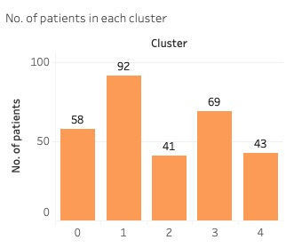

# K-Mean Clustering of Long Beach Patients with Heart Disease
## Overview
This project aimed to create a K-Mean Clustering to group anonymized data of patients who have been diagnosed with heart disease. This project utilized a dataset called [Heart_Disease_Cluster.csv](data/Heart_Disease_Cluster.csv), which contains information about patients with heart disease who are from Long Beach, LA. Based on inertia and silhouette scores, the patients were segmented into five groups, cluster 0 to 4. Subsequently, Decision Tree Classification was performed to identify distinct charateristics of each cluster, providing valuable insights for personalized treatment plans. [Overview of characteristics of each cluster can be found on Tableau Public.](https://public.tableau.com/views/HeartDiseasePortfolio/Story1?:language=en-US&:sid=&:display_count=n&:origin=viz_share_link) 
## Circumstance Understanding
Heart disease has been the leading casue of death in US for over a century as highlighed by the [American Heart Association](https://newsroom.heart.org/news/more-than-half-of-u-s-adults-dont-know-heart-disease-is-leading-cause-of-death-despite-100-year-reign). Despite recent declines in mortality rates due to advances in diagonsis and treatment, heart disease remains a significant health threat. Therefore, by leveraging data-driven insights, we can uncover patterns and similarities among patients by grouping patients into distinct clusters based on their medical characteristics, enabling healthcare providers to tailor treatments to specific patients groups more effectively. For instance, one cluster may respond better to lifestyle changes, while another might benefit more from specific medications or surgical interventions. 
## Data Understanding
The data consisted of 303 patients and 12 features. The features included information on patients' ID, age, sex, chest pain type, resting blood pressure, serum cholesterol level, fasting blood sugar >120mg/dl, resting electrocardiographic results, maximum heart rate, exercise-induced angina, ST depression induced by exercise relative to rest, and slope of the peak exercise ST segment. The bar graph below shows how many patients are in each of five clusters. 

## [Modeling and Evaluation](https://github.com/salaikht9228/Patients-Segmentation-Portfolio-Project/blob/main/Heart%20Disease%20in%20Long%20Beach.ipynb)
Based on the K-Mean Clustering and Decision Tree Classification, the patients were grouped into five clusters, each charaterized by specific medical attributes. The table below outlines the most prominent characteristics of the patients in each cluster. 

Cluster No.| Characteristics|
-----|-----|
0| Predominantly female patients with an upsloping or flat slope of peak exercise ST segment.|
1| Patients with at most 253.5 mg/dl serum cholesterol levels and ST depression induced by exercise relative to rest of less than 2.3.|
2| Patients with a flat or downsloping slope of peak exercise ST segment and ST depression induced by exercise relative to rest of more than 0.3.|
3| Patients who experience exercise-induced angina.|
4| Patients with fasting blood sugar levels greater than 120 mg/dl.|

## Conclusion
Using K-Mean Clustering and Decision Tree Classification, the five clusters of patients reveal significant patterns, such as patients with similar cholesterol levels, exercise-induced angia, and fasting blood sugar levels. Understanding these clusters is crucial for personalized medicine, as it allows for the tailoring of treatments to the specific needs of each patient group, thereby improving treatment outcomes and optimizing the use of medical resources. This project not only demonstrates the practical application of machine learning techniques in healthcare but also sets a foundation for future research and advanced predictive modeling efforts. By continuing to explore and refine these methods, we can contribute to the advancement of personalized medicine and improve health outcomes for patients with heart disease.
